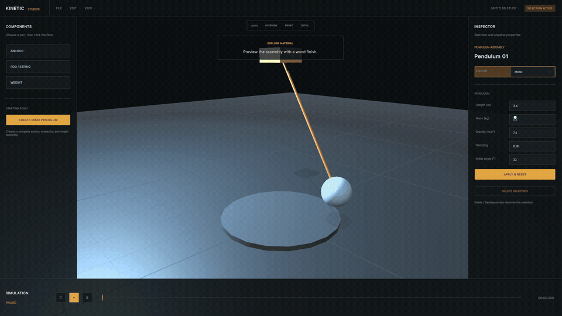

<p align="center">
  
</p>

<h1 align="center">Kinetic Studios</h1>

<p align="center"><strong>A desktop-first virtual studio for prototyping kinetic art before it is built.</strong></p>

<p align="center">
  <a href="Media/demo.mp4"></a>
</p>

## Features

- Assemble a pendulum from reusable anchor, connector, and weight components.
- Tune length, mass, gravity, damping, and initial angle in a focused inspector.
- Switch between wood, metal, rope, and glass material studies.
- Play, pause, and reset the simulation while inspecting motion from any angle.
- Navigate with desktop orbit, pan, zoom, and three presentation-ready camera presets.
- Run a guided 60–90 second product walkthrough with `F9` in Play Mode.

## Demo

[Watch the full 82-second demo in 1080p/60](Media/demo.mp4). The animated preview above links to the same video.

## Studio highlights

<p align="center">
  
</p>

<p align="center">
  
  
</p>

<p align="center">
  
  
</p>

## Architecture overview

The MVP is deliberately small and modular. `Bootstrap` owns startup and loads `StudioWorkspace`. Runtime assemblies separate studio navigation, builder state, pendulum behavior, UI orchestration, and the optional demo director. UI Toolkit provides the shell, while Unity Physics drives the prototype.

```text
Bootstrap scene
  └── StudioWorkspace scene
      ├── StudioShellController ── UI Toolkit shell
      ├── StudioBuilderController ── placement and selection
      ├── PendulumAssembly ── editable physical model
      ├── StudioCameraController ── navigation and presets
      └── DemoWalkthroughController ── presentation-only guidance
```

`Editor/Phase2SceneBuilder.cs` remains a temporary integration utility that can regenerate the MVP scene references and material presets. It is not part of runtime behavior.

## Current capabilities

Kinetic Studios v0.1.0 is a focused vertical slice: a polished studio shell, basic component placement and deletion, one assembled pendulum, live property editing, four visual materials, simulation transport controls, camera presets, and a guided portfolio walkthrough. Save/load, undo/redo, generalized constraints, XR, and web interoperability are not included yet.

## Roadmap

- **v0.2 — Authoring foundation:** durable design data, save/load, undo/redo, and reusable assemblies.
- **v0.3 — Simulation tools:** constraints, actuators, measurements, comparison, and export workflows.
- **v0.4 — Immersive interaction:** XR input adapters over the same studio and design model.
- **Later — Web companion:** lightweight browser exploration for a supported subset of studio documents.

Roadmap items describe direction, not committed release dates.

## How to run

1. Install Unity Hub and Unity Editor **6000.3.17f1**.
2. Clone the repository and add its root folder in Unity Hub.
3. Allow packages and assets to import.
4. Open `Assets/KineticStudios/Scenes/Bootstrap.unity`.
5. Press Play. Press `F9` to launch the guided walkthrough.

If scene references need to be regenerated during development, choose **Kinetic Studios → Phase 2 → Integrate MVP Builder**, then save the scene. The committed scenes are already integrated.

## Controls

| Action | Control |
| --- | --- |
| Orbit | Right mouse drag |
| Pan | Middle mouse drag |
| Zoom | Mouse wheel |
| Select | Left click an object |
| Delete | Inspector button, `Delete`, or `Backspace` |
| Guided demo | `F9` in Play Mode |
| Camera presets | Overview, Front, Detail buttons |

## Project structure

```text
Assets/KineticStudios/
├── Art/Materials/        Studio and prototype materials
├── Editor/               Temporary scene integration tooling
├── Runtime/              Bootstrap, builder, camera, demo, and UI code
├── Scenes/               Bootstrap and StudioWorkspace
└── UI/                   UI Toolkit layouts, styles, and theme
Documentation/            Recording guide and portfolio case study
Media/                    Demo video, GIF, screenshots, and release artwork
Packages/                 Minimal Unity package manifest
ProjectSettings/          Unity 6000.3.17f1 project configuration
```

## Future vision

Kinetic Studios is intended to become a virtual prototyping environment where artists, designers, researchers, educators, and engineers can explore motion-based sculptures before committing physical materials and fabrication time. Desktop remains the primary authoring experience; future XR devices should provide alternate interaction with the same documents and simulation model rather than become separate applications.

## Project evolution

The project began as **SimplePendulum**, an exploratory visualization concept. It has been rebuilt as Kinetic Studios with a clean Unity 6 foundation and a broader goal: a reusable virtual studio for kinetic-art design. Historical concept references remain available as a [simple pendulum video](https://github.com/user-attachments/assets/90379d1d-73a5-4150-adbc-98b1c88eec39) and [multi-pendulum studio video](https://github.com/user-attachments/assets/b98e6284-e10c-4058-8cd9-b91bed887d34).

## Acknowledgements

Kinetic Studios is inspired by kinetic artists and mechanism designers who turn motion, timing, material, and space into an expressive medium. Built with [Unity](https://unity.com/).

Contributions are welcome; read [CONTRIBUTING.md](CONTRIBUTING.md) before opening an issue or pull request. Citation metadata is provided in [CITATION.cff](CITATION.cff).

For the design and engineering story, read the [portfolio case study](Documentation/PortfolioCaseStudy.md). Release scope and suggested repository metadata are in the [v0.1.0 release notes](Documentation/Release-v0.1.0.md).

## License

Released under the [MIT License](LICENSE).
